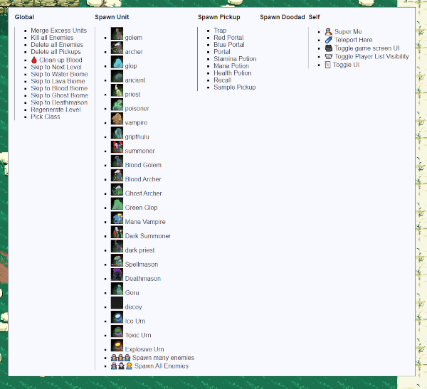
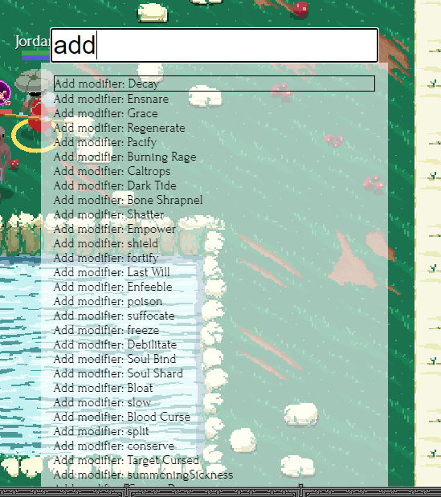

# Modding Spellmasons 🧙🔧

With Spellmasons mods you can create 🔮**new spells**, 👹**new enemies**, 🥶**new modifiers**, ⚗️**new potions**, 🖼️**custom animations**, 💥**custom sound effects**.

All you need is a good idea and a little [Typescript](https://www.typescriptlang.org/) and [Github](https://github.com/) knowhow!

Let's get started!

## Getting Started
### Installation
1. Install [Node.js](https://nodejs.org)
2. If you haven't already, clone this repository
3. Open a terminal window and navigate to where the repository was cloned (such as `cd C:\\Spellmasons`) and run `npm install`.  (This installs all the packages needed to run Spellmasons)
4. Now you're ready to run a development version the game locally!  Type `npm start`.  If all goes well, you can open a browser window to `http://localhost:3000/` and you'll see the game.

Now let's modify our first mod!

### Tweaking a sample mod
Let's modify the Sample Pickup.  First we need to spawn one.  Once you have the game running per the above instructions, hover your cursor over where you want to spawn the pickup and press the control key and the space key.  This brings up the Admin Quick Menu.  Type "Sample Pickup" and press "Enter". You should see a light purple potion spawn.

Now this is the fun part!  Open `src\DevelopmentMods\SamplePickup\SamplePickup.ts` and change something!  Make sure it's obvious like changing `scale: 1.0` to `scale: 3.0` or something.
When you save the file, the browser should automatically refresh.  Recreate the potion and notice that it's much larger!

Congrats! You've successfully made your first change!  Feel free to use spells and pickups in the core engine code or other mods for a jumping-off point to get you started.


### Mod Rules
1. Mods can import any `type`
For example 
`import type { Vec2 } from './jmath/Vec';`
2. Mods may **not** import anything else from outside the mod's folder that isn't exposed via SpellmasonsAPI
Example:
```js
// INCORRECT:
import * as cardUtils from "./cards/cardUtils";
import * as PlanningView from './graphics/PlanningView';
import * as cards from './cards/index';

// Correct:
const {
    cardUtils,
    PlanningView,
    cards,
} = globalThis.SpellmasonsAPI;
```

### Admin Tools
Admin tools make development a lot easier.

Press F12 to open up the Developer Tools.  In the console tab, you can type `devUnderworld` to inspect the gamestate.
Type `selectedUnit` to inspect the unit that has last been clicked on (selected) or `selectedPickup` to inspect the pickup that is selected.

AdminMode is automatically turned on when you're developing locally in a browser.  If AdminMode is on you can **Shift+Left click** anywhere in the game to bring up an Admin menu that allows you to place enemies, pickups and more.




There's also the Admin Quick Menu.  Press the **Control and Space keys** at the same time and type what you want.  This menu is useful for giving yourself specific spells or adding a modifier to
a unit that is selected.



Also I recommend using the menu's Save and Load regularly.  Do note that some changes occur on init of a unit or pickup and so won't be reflected in a loaded savefile but some changes (like spell effects that trigger when cast) will work after loading an save that occurred before the change was made.
Regardless, with the admin tools it's super easy and quick to set up a test scene so even without save / load it is still rather efficient.

### More examples
- Pickup (potion, etc): src\DevelopmentMods\SamplePickup\SamplePickup.ts
- Spell: public\spellmasons-mods\undead_blade\undead_blade.ts
- Modifier (Poison, Frozen, etc): src\DevelopmentMods\SampleModifier\SampleModifier.ts
- Unit: TODO
- Animation: https://youtu.be/_DkjB0BvVU4?si=clsWXsOj2rq3iiOn
- SFX: TODO

## Modifiers and Events
Many things in Spellmasons take immediate effect (such as spells); however, if you wish to do something more complex you're probably looking for Modifiers and Events.

Modifiers attach `data` to a unit instance that can be later used in events.  Example events are "onDealDamage", "onDeath", "onTurnEnd".  You can view the full list in `src\cards\index.ts` (look for `interface Events`).

Check out `src\DevelopmentMods\SampleModifier\SampleModifier.ts` for an example modifier and event.  Modifiers can be added to units when a spell is triggered, when a pickup is triggered, or automatically (with a probability) when a miniboss spawns.

Modifiers and events often work hand-in-hand.  For example, the modifier "poison" (`src\cards\poison.ts`) tracks the strength of the poison while it's associated event of the same id delivers damage when the unit's turn ends.  

There's a LOT of cool stuff you can do with modifiers.

## Publishing Your Mod
To publish your mod so it's available on the Community Servers and available to all players, clone the [mods repository](https://github.com/jdoleary/spellmasons-mods), and move your mod into that folder.

You will probably need to update the paths of the imports.  Make sure that the imports follow the "Mod Rules" outlined above, and use the other mods as examples if you get stuck.

Finally, open a PR.  If the mod works well and is bug free (I will help with Quality Assurance), I will merge it into the mods repo and it will ship out with the next update!

You will also earn the "Modder" role in the Discord!

# DOCS BELOW ARE UNDER CONSTRUCTION
## INTERNAL _ Jordan todo
- [ ] Make sample mods for
  - [ ] New Enemy
  - [ ] New Modifier
  - [ ] New Animation and SFX

## Background
[The game engine repository](https://github.com/jdoleary/Spellmasons) holds the Spellmasons game and engine code.  There you can run the game locally and test out your mod quickly!  When you're ready to make your mod public, it will have to be moved to the [mods repository](https://github.com/jdoleary/spellmasons-mods).  But I'll show you how to do that later.  

Let's start with a quick example.
## Footguns
- When making a targeting spell be sure to iterate it like so:
```js
      const length = targets.length;
      for (let i = 0; i < length; i++) {
        const target = targets[i];
        if (!target) {
          continue;
        }
        // Do stuff here
        if(isConditionMet){
            addTarget(newTarget, state);
        }
      }
```
NOT like:
```js
for(let target of targets){
    // Do stuff here
    if(isConditionMet){
        addTarget(newTarget, state);
    }

}
```
This is because `addTarget` mutates the target array and you will get undesired behavior if
you invoke addTarget within a for..of that iterates targets array.